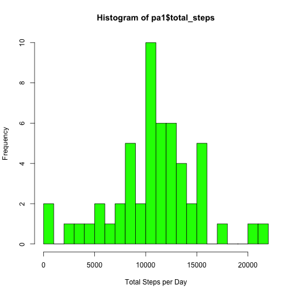
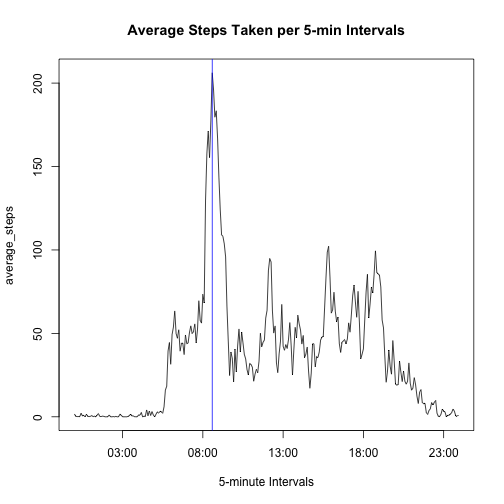
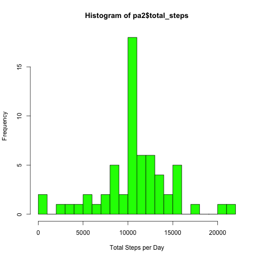
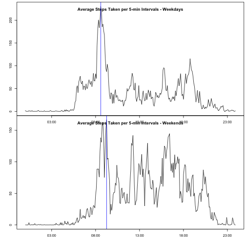

# Necessary work to get the data in...
## load necessary libraries

```r
require(dplyr)
require(ggplot2)
require(Hmisc)
```
	
## read the data file

```r
fileurl <- "./activity.csv"
pa1raw <- read.csv(fileurl)
```

## raw data pre-process -> make "date" into Date format

```r
pa1raw <- pa1raw %>% 
mutate(fdate = as.Date(date, format("%Y-%m-%d"))) %>% 
mutate(intervalt = as.POSIXct(formatC(interval, width=4, flag="0"),format="%H%M")) %>%
select(-date)
```
		

# What is the mean total of steps taken per day?
## calcuate total steps per day

```r
pa1 <- pa1raw %>% 
group_by(fdate) %>%
summarise(total_steps = sum(steps))
```

## show total steps per day in a histogram


## calculate and report mean and median of the total number of steps taken per day

```r
meanvalue <- as.integer(mean(pa1$total_steps,na.rm=TRUE))
medianvalue <- median(pa1$total_steps,na.rm=TRUE)
```

Mean is 10766

Median is 10765


# What is the daily average activity pattern?
## calcuate average steps per 5-minute interval

```r
pa1 <- pa1raw %>% 
group_by(intervalt) %>%
summarise(average_steps = mean(steps, na.rm=TRUE))
```

## plot average steps per 5-min interval in time series plot

Average steps per 5-min interval 2016-03-14 08:35:00


# Imputing missing values 
## Calculate and report the total number of missing values in the dataset
How many NAs are there in the dataset (activities.csv) 2304

## Assign average value of interval if step is NA

```r
pa1c <- pa1raw
for(i in 1:nrow(pa1c)) {
if(is.na(pa1c$steps[i])) {
pa1c$steps[i] <- as.integer(pa1$average_steps[which(pa1$intervalt == pa1c$intervalt[i])])
}
}
```

## Re-look at total, mean, and median values

```r
pa2 <- pa1c %>% 
group_by(fdate) %>%
summarise(total_steps = sum(steps))
```

## show total steps per day in a histogram


## calculate and report mean and median of the total number of steps taken per day
Adjusted mean with imputed NAs is 10749
Adjusted mediam with imputed NAs is 10641

## values are different from when we calcuated the same stats excluding the NAs in the dataset

# Are there differences in activity patterns between weekdays and weekends?
## create a new factor variable in the dataset with two levels - "weekday" and "weekend" indicating whether a given date is a weekday or weekend day.

```r
for(i in 1:nrow(pa1c)) {
dofw <- weekdays(pa1c$fdate[i]) 
if(dofw %in% c("Saturday","Sunday")){
pa1c$dayofweeks[i] <- "weekend"
} else {
pa1c$dayofweeks[i] <- "weekday"
}
}

pa3 <- pa1c %>% 
filter(dayofweeks == "weekday") %>%
group_by(intervalt) %>%
summarise(average_steps = mean(steps, na.rm=TRUE))

pa4 <- pa1c %>% 
filter(dayofweeks == "weekend") %>%
group_by(intervalt) %>%
summarise(average_steps = mean(steps, na.rm=TRUE))
```

## plot average steps per 5-min interval in time series plot

